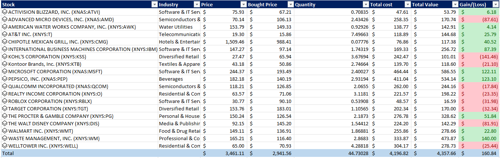
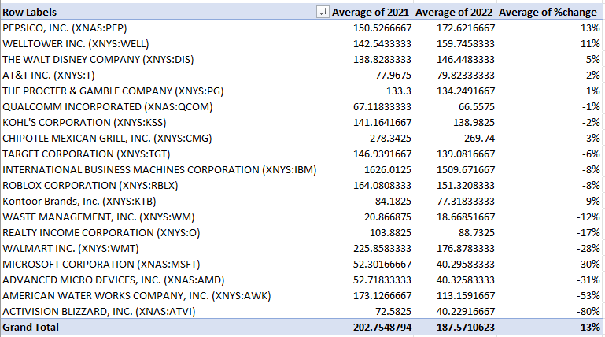
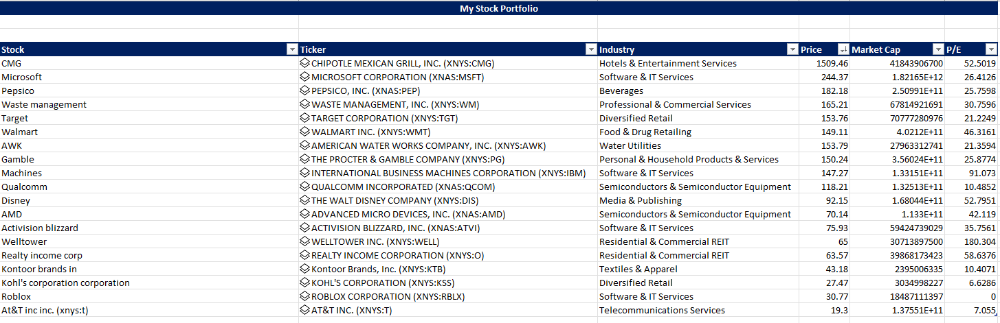
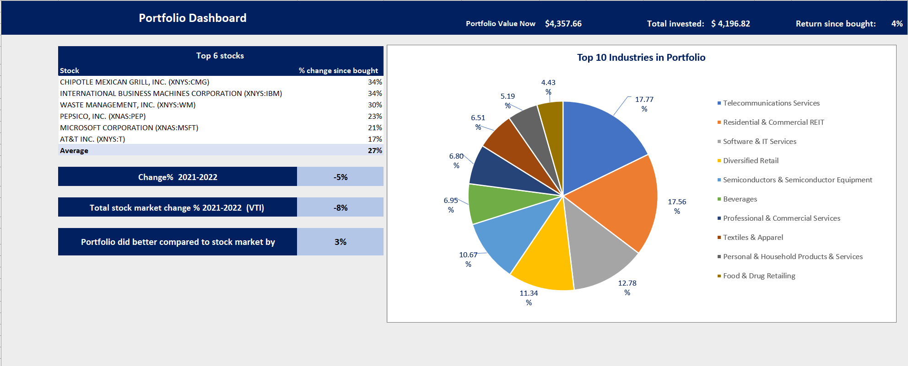

# Excel stock portfolio

In this project I wanted to get more information about the stocks I had in my M1 finance account. I used my excel skills to make a portfolio and 
a dashboard to show the information I found.

## Questions

- **What is the total return on my portfolio?**
- **What is the yearly return?**
- **How many companies does the portfolio have?**
- **What is the amount invested?**

## **What was the return in my portfolio?**

To find out the return in my portfolio I had to get the amount of shares I had and the original cost of each stock. Then I could multiply the amount of shares to the stock price now. The current value of a stock minus the original stock price gave me the amount the stock changed and if it was a gain or a loss.

## **What is the yearly return?**

To get the yearly return from 2021 to 2022 we got the averages of both 2021 and 2021 and calculated the percentage change in that year.
  

## **How many companies does the portfolio have?**
In the stock overview image we can see the amount of stocks we have which is 19.

## **What is the amount invested?**
In our dashboard we can see how much we invested and what the return was. We can also see the change in 2021-2022 and top companies.
  

